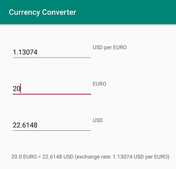

# Android App trying to use two-way databinding

This Android App is a currency converter.

It works as expected but probably not implemented in the best way.  
If you know how to implement it better then please do contribute in [issue 1](https://github.com/peon73/CurrencyConverter/issues/1)

The purpose of the App is to experiment with Android MVVM/ViewModel/LiveData/databinding.



There are three input fields as in the above screenshot.  
When one of the three fields is changed, then one of the other two fields is also changed.  
The text below the input fields is also changed when any of the three fields are changed.  
Field 1: The exchange rate.  
Field 2: Euros  
Field 3: Dollars  

Field 3 should always be equal to a multiplication with field 1 and field 2 as factors.  
When the user edits field 1, then field 3 becomes updated.  
When the user edits field 2, then field 3 becomes updated.  
When the user edits field 3, then field 2 becomes updated.  


# Layout file with two-way databindings for the edit fields and one-way databinding for the textfield

[app/src/main/res/layout/activity_main.xml](https://github.com/peon73/CurrencyConverter/blob/master/app/src/main/res/layout/activity_main.xml)
```xml
<layout xmlns:android="http://schemas.android.com/apk/res/android">
<data>
    <variable name="theCurrencyViewModel" type="com.currencyconverter.CurrencyViewModel"/>
</data>
...
<EditText android:id="@+id/editTextConversionRateDollarsPerEuro"
    ...
    android:text="@={theCurrencyViewModel.conversionRateDollarsPerEuro}"
/>
...
<EditText android:id="@+id/editTextEuro"
    ...
    android:text="@={theCurrencyViewModel.euro}"
/>
...
<EditText android:id="@+id/editTextDollar"
    ...
    android:text="@={theCurrencyViewModel.dollars}"
/>
...
<TextView android:id="@+id/textViewConversionResult"
    ...
    android:text="@{theCurrencyViewModel.conversionResultDisplayText}"
/>
```

# The three classes in the app

[app/src/main/java/com/currencyconverter/CurrencyModel.java](https://github.com/peon73/CurrencyConverter/blob/master/app/src/main/java/com/currencyconverter/CurrencyModel.java)  
[app/src/main/java/com/currencyconverter/CurrencyViewModel.java](https://github.com/peon73/CurrencyConverter/blob/master/app/src/main/java/com/currencyconverter/CurrencyViewModel.java)  
[app/src/main/java/com/currencyconverter/MainActivity.java](https://github.com/peon73/CurrencyConverter/blob/master/app/src/main/java/com/currencyconverter/MainActivity.java)  

# Java View Model class

**Questions** I would like to find answers for:

**What is the best way of avoiding that a text field modification triggers updates in an eternal loop?**  
I have implemented it with if statements (e.g. using code such as "*if(mCurrencyModel.isConversionRateDollarsPerEuroChanged(value))*") but it feels as to much code and maybe there is some better way of preventing eternal code?  

**Is it somehow (how?) possible to avoid exposing "MutableLiveData<String>" for a two way databinding ?**  
Exposing (in a public method return value) a  reference to MutableLiveData seem to be similarly ugly (regarding encapsulation) as exposing a modifiable list instead of exposing an unmodifiableCollection.  

It would seem to be more clean to expose a LiveData instead of MutableLiveData but then the two way code does not seem to work.  

I have tried using a setter method with either "String" or "LiveData<String>" but have not succeeded.  

If I would have succeeded with a setter method to become invoked, then from there I would have updated 
a new value in one of the othe fields, but since I could not do that, instead I used an observer 
for the MutableLiveData fields.

I think the observer may be used with a LiveData (i.e. not necessary with MutableLiveData) but to be able to trigger edit events with the two-way databinding, then a MutableLiveData seem to be necessary to expose instead of LiveData.

Also, it seems as the observer must be triggered from the Activity since it needs a LifecycleOwner as parameter.  
Is this necessary?  
Or **is it possible somehow (how?) to avoid observer triggering code in the activity and use setters (or observers) in the view model?**

The full code to the three java classes can be found through the links in the above section.  
Below is just some parts of the the view model class, to help illustrating the above questions and the above layout file in a section above.
```java
public final class CurrencyViewModel extends ViewModel {
	
    // GUI independent model class i.e. would be easy to reuse from a non-Android application
    private final CurrencyModel mCurrencyModel = new CurrencyModel();

    private final MutableLiveData<String> mLiveDataConversionRateDollarsPerEuro = new MutableLiveData<String>();
    private final MutableLiveData<String> mLiveDataEuro = new MutableLiveData<String>();
    private final MutableLiveData<String> mLiveDataDollars = new MutableLiveData<String>();
    private final MutableLiveData<String> mLiveDataConversionResultDisplayText = new MutableLiveData<String>();

    // two way databinding in the above layout file 
    // i.e. android:text="@={theCurrencyViewModel.conversionRateDollarsPerEuro}"
    public MutableLiveData<String> getConversionRateDollarsPerEuro() {
        return mLiveDataConversionRateDollarsPerEuro;
    }
	
    public MutableLiveData<String> getDollars() {
        return mLiveDataDollars;
    }
	
    public MutableLiveData<String> getEuro() {
        return this.mLiveDataEuro;
    }
	
    // one way binding from the above layout file 
    public LiveData<String> getConversionResultDisplayText() {
        return mLiveDataConversionResultDisplayText;
    }	

    // It seems necessary to invoke this method from the Activity to be 
    // able to get a reference to a LifecycleOwner ?
    public void observeConversionRateDollarsPerEuro(LifecycleOwner lifecycleOwner) {
        final CurrencyViewModel currencyViewModel = this;
        this.mLiveDataConversionRateDollarsPerEuro.observe(lifecycleOwner,  new Observer<String>(){
            @Override
            public void onChanged(String value) {
                currencyViewModel.setConversionRateDollarsPerEuro(value);
            }
        });
    }
    // ...
    // two other observe methods similar to the above, for the other two input fields.
    // ...
	
    private void setConversionRateDollarsPerEuro(String value) {
        if(mCurrencyModel.isConversionRateDollarsPerEuroChanged(value)) {
            mCurrencyModel.setConversionRateDollarsPerEuroFromString(value);
            this.mLiveDataConversionRateDollarsPerEuro.setValue(value);
            this.mLiveDataDollars.setValue("" + mCurrencyModel.getDollarValue());
            updateConversionResultDisplayText();
        }
    }
    // ...
    // two other setter methods similar to the above, for the other two input fields
    // ...
	
	
```